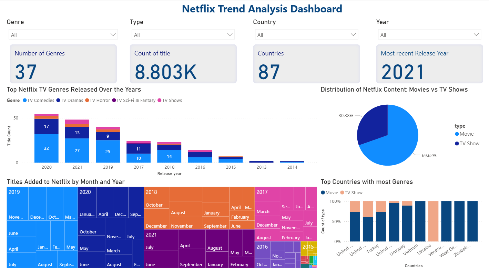

# 📺 Netflix Trend Analysis Dashboard

---

🔹 **1. Business Problem (Context):**  
The streaming industry is growing rapidly, and Netflix remains a major player with a vast library of content.  
Understanding the distribution of titles, genres, release years, and availability across countries can help:
- **Content Strategy Teams** identify gaps in offerings.
- **Data Analysts** gain insights into content diversity.
- **Viewers** explore trends in movies and TV shows.

**Objective:** Analyze Netflix’s titles dataset to identify:
- Distribution of Movies vs. TV Shows.
- Most common genres and release years.
- Country-wise availability of titles.
- Recent content trends.

---

🔹 **2. Your Role & Responsibilities:**  
I handled the project from start to finish:
- **Data Collection:** Used publicly available Netflix titles dataset (CSV).  
- **Data Cleaning (Python):** Removed duplicates, handled missing values, standardized columns like *Country* and *Date Added*.  
- **Feature Engineering:** Extracted *Release Year*, *Content Type* split, and *Genre Classification*.  
- **Data Transformation:** Prepared data in Python for Power BI ingestion.  
- **Visualization:** Designed an interactive **Power BI dashboard** with slicers, cards, bar charts, maps, and line graphs.  

---

🔹 **3. Tools & Techniques Used:**  
- **Python (Pandas):** Data cleaning & preparation.  
- **Power BI:** Dashboard creation, KPI cards, slicers, and interactivity.  
- **Power Query (within Power BI):** Column transformations & date formatting.  

---

🔹 **4. Challenges & Solutions:**  
- **Challenge:** Missing country values in some titles.  
  **Solution:** Filled using other metadata like director or cast information.  

- **Challenge:** “Date Added” column had inconsistent formats.  
  **Solution:** Converted to proper `datetime` format in Power BI.  

- **Challenge:** Most recent release year in KPI card was displaying as “2K”.  
  **Solution:** Changed summarization from default format to “Don’t Summarize” and used the correct data type.  

---

🔹 **5. Business Impact & Results:**  
✅ Identified that **Movies** dominate Netflix’s content (~70%).  
✅ Discovered top contributing countries (USA, UK).  
✅ Highlighted genres that Netflix focuses on most.  
✅ Mapped global availability trends.  

This dashboard helps Netflix and analysts understand **content distribution trends** and **make data-driven content acquisition decisions**.

---

## 📸 Dashboard Preview

---

## 📂 Project Files
| File | Description |
|------|-------------|
| `Netflix Trend Analysis Dashboard.pbix` | Power BI dashboard file |
| `netflix_titles.csv` | Cleaned Netflix titles dataset |
| `Netflix_Analysis_Dashboard.png` | Snapshot of the dashboard |
| `README.md` | Project documentation |

---
